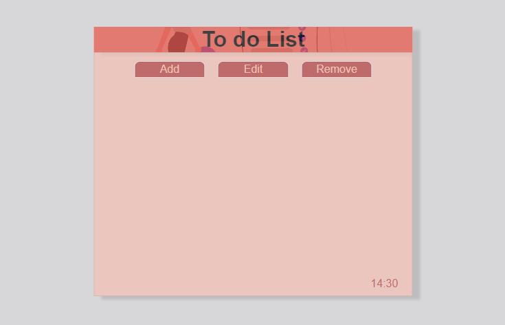

# To Do List

This is a simple to-do list application with basic functionalities to add, edit, and remove items from the list.

## Functionalities

- **Add Task:** First, click the "Add" button to open the text input field. Enter the desired task, then click the "Submit" button to add it to the list.
- **Edit Task:** Click the "✏️" button next to a task to modify its content.
- **Remove Task:** Click the "❌" button next to a task to delete it from the list.

## How to Use

1. **Add Task:**
   - Click the "Add" button.
   - Type the task into the text input field.
   - Click the "Submit" button.

2. **Edit Task:**
   - Locate the task in the list.
   - Click the "✏️" button next to the task.
   - Make necessary changes in the text input field.
   - Click the corresponding emoji to confirm ("✅" to save or "❌" to cancel).

3. **Remove Task:**
   - Locate the task in the list.
   - Click the "❌" button next to the task.

## Technologies Used

This application was developed using the following technologies:

- HTML
- SASS
- JavaScript

## Vercel

This project is hosted on Vercel. Click [here](https://to-do-list-one-red.vercel.app) to view it.

## Author

This project was developed by Johan Queiroz.

### Contributing

Feel free to contribute by adding new features, reporting issues, or suggesting improvements. Simply open an issue or submit a pull request to the project repository.

### License

This project is licensed under the [MIT License](LICENSE).
